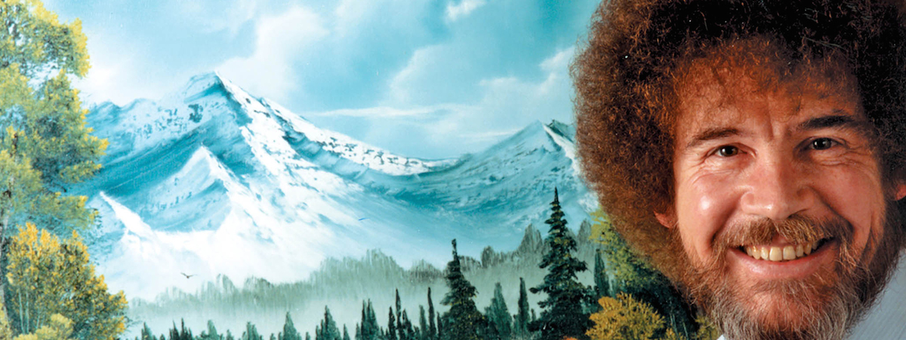

  <h1 align="center">
  
   The Joy of Coding</h1>
  <h3 align="center">Exploring ETL with Bob Ross!</h2>


# Introduction

This project was designed to explore the concept of **ETL (Extract, Transform, Load)**, which is the process of taking data from multiple unique sources, modifying or *cleaning* the data to be more uniform, and storing them in a centralized database.

[The Joy of Painting](https://en.wikipedia.org/wiki/The_Joy_of_Painting) is a television show that ran from 1983 until 1994, and featured the ever-so-tranquil [Bob Ross](https://en.wikipedia.org/wiki/Bob_Ross) instucting the public on the painting techniques, life lessons, and the beauty of nature. This project started with a hypothetical news station who had gathered data on the paintings and episodes of the show, but needed a better way for their viewers to search and query different details about the content. Starting with CSV and TXT files, **The Joy of Coding** contains a program to query and organize the large amount of data for easier access to viewers. 

# Data Structure

Each entry in the database is unique to the painting that was made. It contains attribtues for the user to search and organize by:
```

Each Painting has the following:
    ID: Unique for the painting
    TITLE: The Title of the painting
    AIR_DATE: The date the episode featuring the painting aired
    SPECIAL_GUEST: A name of a special guest on the episode, or None if not
    EPISODE: Season/Episode number in the S##E## format
    SUBJECTS: Objects or subjects of the painting featured (e.g. bushes, trees)
    IMAGE_URL: Contains an image of the painting
    VIDEO_URL: A link to a YouTube video of the episode
    NUM_COLORS: The total number of paint colors used in the painting
    COLORS: An array of the colors used in the painting, including the name and hex code value
```
